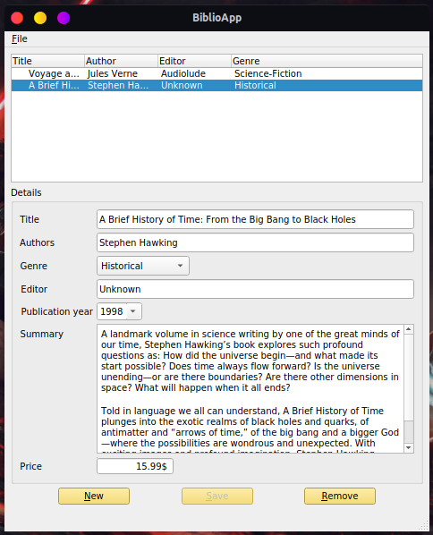

# BiblioAppJSon
A test of using JSon file in PyQt5 to create a small Library !

## Requirement 

-   PyQt5 (or see PySide2)  
-   Python3.x  

## Install requirement  

On `conda` environment run :  

-   **PyQt5**  ```conda install pyqt``` or ```conda install -c anaconda pyqt```
-   **PySide2** ```conda install -c conda-forge pyside2```

## Run the main  script

Clone this repository `https://github.com/faouziMohamed/BiblioApp.git`  and run the main script `main.py`

  ```bash
  git clone https://github.com/faouziMohamed/BiblioApp.git
  cd BiblioApp/src
  python main.py
  ```

## Preview

|                      BiblioApp                       |
| :--------------------------------------------------: |
|  |
--------------------------------------------------------------------------------
### Alternative
There is a version using database (SQLite) insteade of JSon file here [BiblioAppBD](https://github.com/faouziMohamed/BiblioAppBd)
